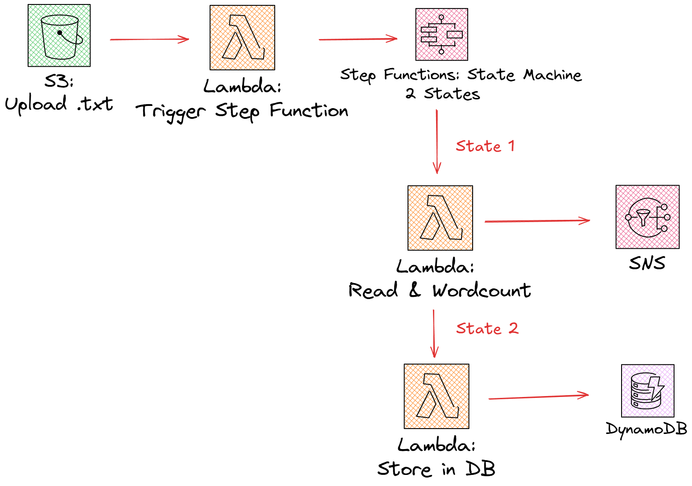

# 🧠 AWS Serverless Word Count Pipeline

A **fully automated, event-driven serverless data pipeline** built with AWS Lambda, S3, Step Functions, DynamoDB, and SNS.  
When you upload a `.txt` file to an S3 bucket, the pipeline automatically counts word frequencies, stores the results in DynamoDB, and emails you a summary report via SNS.

---

## 🚀 Architecture Overview





---

## 🧩 AWS Services Used

| Service | Purpose |
|----------|----------|
| **Amazon S3** | Stores uploaded `.txt` files |
| **AWS Lambda** | Performs file processing and orchestration |
| **AWS Step Functions** | Coordinates multiple Lambdas in sequence |
| **Amazon DynamoDB** | Stores word count results |
| **Amazon SNS** | Sends email reports |
| **Amazon CloudWatch** | Logs and monitors execution |
| **IAM (Identity & Access Management)** | Controls permissions for each component |

---

## ⚙️ Workflow Summary

1. A `.txt` file is uploaded to an **S3 bucket**.  
2. The **TriggerStepFunction Lambda** starts the Step Function execution.  
3. **Step Function** runs two tasks in order:  
   - **Lambda #1:** Reads the file, counts words, and sends an SNS email summary.  
   - **Lambda #2:** Saves the word count results in a DynamoDB table.  
4. The process completes automatically — no manual steps required.

---

## 🧱 Repository Structure

```
aws-serverless-wordcount/
│
├── lambdas/                     # All Lambda functions + README
│   ├── WordCountProcessor.py
│   ├── StoreWordCountResults.py
│   ├── TriggerStepFunction.py
│   └── README.md
│
├── step_function/               # State machine JSON + README
│   ├── state_machine_definition.json
│   └── README.md
│
├── s3_setup/                    # Instructions for S3 bucket + Lambda trigger
│   └── README.md
│
├── dynamodb_setup/              # Instructions for DynamoDB setup
│   └── README.md
│
├── sns_setup/                   # Instructions for SNS topic + subscription
│   └── README.md
│
└── README.md                    # (this file)
```

---

## 🔧 Deployment Steps (AWS Console)

### 1️⃣ Create the DynamoDB Table
Follow `/dynamodb_setup/README.md`

### 2️⃣ Create the SNS Topic
Follow `/sns_setup/README.md`

### 3️⃣ Create the S3 Bucket
Follow `/s3_setup/README.md`

### 4️⃣ Deploy Lambda Functions
Follow `/lambdas/README.md`

### 5️⃣ Create the Step Function
Follow `/step_function/README.md`

---

## 🧾 Example Outputs

### 📧 SNS Email
```
File processed: uploads/story.txt
Total word count: 4823

Top 10 words:
the: 312
and: 243
to: 195
of: 187
a: 166
in: 144
is: 92
for: 77
that: 65
was: 61
```

### 🗃️ DynamoDB Record
```json
{
  "id": 1730468350,
  "file_name": "uploads/story.txt",
  "total_words": 4823,
  "top_words": { "the": 312, "and": 243, "to": 195 },
  "processed_at": "2025-11-01T12:34:56Z",
  "processed_date": "2025-11-01"
}
```

---

## 🧪 Testing the Pipeline

1. Upload a `.txt` file to your S3 bucket (e.g., `uploads/test.txt`)
2. Watch your **Step Function** start automatically
3. Check:
   - ✅ Email report from SNS  
   - ✅ Record in DynamoDB  
   - ✅ Logs in CloudWatch  

If all three succeed, your pipeline is working perfectly 🎉

---

## 💡 Optional Enhancements

| Feature | Description |
|----------|-------------|
| **Retry logic** | Add retry blocks in the Step Function for Lambda failures |
| **Processed folder** | Move completed files to an S3 `/processed/` prefix |
| **Metrics dashboard** | Visualize executions with CloudWatch dashboards |
| **QuickSight / Grafana** | Use DynamoDB data for analytics |
